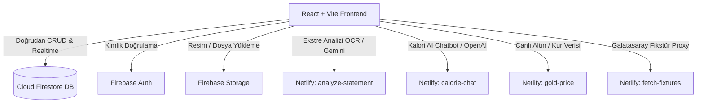
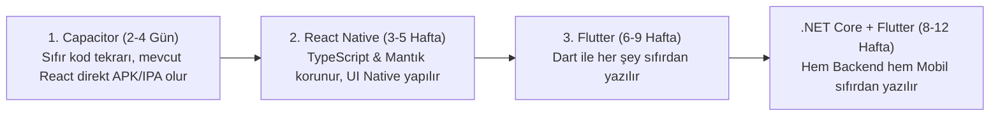

# emuList — Mimari, .NET Core Backend ve Mobil Uygulama Analiz Raporu

Bu belge; projenin mevcut mimari durumunu, .NET Core backend'e geçiş maliyetini, mobil uygulama (Native/Flutter/Capacitor) opsiyonlarını ve bu teknolojilerin birbirleriyle olan etkileşimini ayrıntılı olarak yanıtlamak üzere hazırlanmıştır.

---

## 1. Soru 1: .NET Core Backend'e Taşımak Ne Kadar Sürer?

### Mevcut Durum Özeti:
Şu anda sistemde **bağımsız bir sunucu (Node.js/Express, Python, Java vb.) bulunmamaktadır**. Proje, **BaaS (Backend as a Service)** olarak doğrudan istemciden (Client-side) Firebase SDK'sı ile haberleşmektedir:
- **Veritabanı:** Cloud Firestore (NoSQL Koleksiyonları: `media`, `expenses`, `meetings`, `shifts`, `activityLogs`, `users` vb.)
- **Kimlik Doğrulama (Auth):** Firebase Authentication
- **Dosya Depolama:** Firebase Storage
- **Güvenlik:** `firestore.rules` ve `storage.rules`

### .NET Core (ASP.NET Core Web API) ile Neler Sıfırdan Yazılmalı?
1. **Veritabanı Katmanı & Modeller (Entity Framework Core):**
   - NoSQL (Firestore) yapısının İlişkisel (PostgreSQL / MSSQL) veya Document-based (MongoDB) şemaya modellenmesi.
   - Tablolar: Medya öğeleri, Sezon/Bölüm takibi, Özel listeler, Harcamalar, Taksitler, Yatırımlar (Altın/Döviz), Ajanda/Toplantılar, Nöbet sistemi, Notlar, Gezi planı, Sosyal akış/Tepkiler, Kalori takibi.
2. **Kimlik Doğrulama & Yetkilendirme (Auth):**
   - ASP.NET Core Identity + JWT (JSON Web Token) altyapısı ve rol/admin yönetimi (veya Firebase JWT doğrulama ara katmanı).
3. **İş Mantığı & Servisler (Business Logic / Services):**
   - Firestore'a doğrudan yapılan istemci sorgularının (filtreler, toplu güncellemeler, sayfalama, istatistik hesaplamaları) C# servislerine taşınması.
4. **Harici API Entegrasyonları & Serverless Görevler:**
   - Netlify fonksiyonlarındaki (`calorie-chat`, `analyze-statement`, `gold-price`, `fetch-fixtures`) yapay zeka entegrasyonlarının ve scraping servislerinin `IHttpClientFactory` ve C# HttpClient ile Controller/Minimal API'lere dönüştürülmesi.
5. **Frontend Hook'larının Yeniden Bağlanması:**
   - React tarafındaki `useExpenses`, `useShift`, `usePlanner`, `useMediaItems` gibi Firebase SDK kullanan tüm hook'ların REST API (`fetch` / `axios` / `react-query`) formatına çevrilmesi.

### ⏱️ Süre Tahmini:
| Kapsam | Tahmini Süre (Tek Geliştirici) | Açıklama |
| :--- | :--- | :--- |
| **MVP (Temel Özellikler)** | **1.5 - 2 Hafta** | Auth + Medya Kütüphanesi + Temel Harcama Takibi API'si |
| **Tam Kapsamlı Geçiş (Full Migration)** | **3 - 5 Hafta** | Tüm koleksiyonlar, EF Core migration'ları, AI fonksiyonları, frontend hook'larının dönüştürülmesi ve testler |
| **Canlı Veri Taşıma (Migration Script)** | **3 - 5 Gün** | Mevcut Firestore dokümanlarının export edilip yeni SQL/NoSQL veritabanına dönüştürülerek import edilmesi |

---

## 2. Soru 2: Şu Anda Backend Sadece Fonksiyonlardan mı İbaret?

> [!NOTE]
> **Kısa Cevap:** Hayır, sadece fonksiyonlardan ibaret değildir. Sistemin omurgası **Firebase BaaS (Firestore + Auth + Storage)** üzerinde çalışır. Serverless fonksiyonlar ise sadece istemcide çalıştırılamayan kritik işler için köprü görevi görür.

### Detaylı Mimari Dağılımı:

1. **Ana Backend (Firebase BaaS):**
   - Verilerin %90'ı istemci kodundaki `src/backend/services/` klasöründen doğrudan Firestore'a yazılır ve okunur (`addDoc`, `updateDoc`, `onSnapshot`).
2. **Serverless Fonksiyonlar (`netlify/functions`):**
   - Yalnızca API anahtarlarının (Gemini, OpenAI) gizlenmesi gereken durumlar, PDF/ekstre OCR analizi ve CORS engeli olan harici veri çekme (altın fiyatı, maç fikstürü) için kullanılır.

---

## 3. Soru 3: Responsive Tasarıma Bakarak Native veya Flutter ile Mobil Yapabilir miyiz? Ne Kadar Sürer?

Mevcut web uygulamanız zaten mobil öncelikli (Mobile-First), dokunmatik jestlere duyarlı, PWA uyumlu, `BottomNavBar`, `MobileTopBar` ve `MobileMenu` gibi yerel mobil uygulama benzeri bileşenlere sahiptir. 

Önünüzde **3 farklı mobil yol** bulunmaktadır:

---

### Seçenek A: Capacitor / Ionic (Web to Native Wrapper) — 🚀 **ÖNERİLEN & EN HIZLI**
Mevcut React + Vite kodunuzu **hiç bozmadan**, doğrudan yerel bir iOS (.ipa) ve Android (.apk/.aab) paketine dönüştürür.
- **Nasıl Çalışır:** Capacitor, uygulamanızı yerel bir WebView içine alır; ek olarak yerel bildirimler (Push Notifications), biyometrik kilit (FaceID/Parmak izi), kamera ve yerel depolama API'lerini JavaScript köprüsüyle sunar.
- **Avantajı:** Kod tekrarı %0'dır. Webde yaptığınız her güncelleme anında mobilde de çalışır.
- **⏱️ Süre:** **2 - 4 Gün** (Capacitor kurulumu, Android Studio / Xcode derlemesi, splash screen ve ikon ayarları).

---

### Seçenek B: React Native (Expo) — 📱 **YARI YEREL (SEMI-NATIVE)**
- **Nasıl Çalışır:** Arayüz bileşenleri web HTML/CSS (`div`, `span`, CSS) yerine yerel mobil bileşenlerine (`View`, `Text`, `FlatList`) dönüştürülür.
- **Kod Paylaşımı:** Mevcut `TypeScript` tiplerinizi, yardımcı fonksiyonlarınızı, React Query logic'inizi ve Firebase servislerinizi **%70-80 oranında doğrudan yeniden kullanabilirsiniz**. Yalnızca görsel JSX şablonları React Native bileşenleriyle yeniden yazılır.
- **⏱️ Süre:** **3 - 5 Hafta**.

---

### Seçenek C: Flutter (Google Dart) — 🎨 **TAMAMEN SIFIRDAN YAZIM**
- **Nasıl Çalışır:** Google'ın Dart dili ve Skia/Impeller motoruyla arayüz sıfırdan çizilir.
- **Kod Paylaşımı:** **%0**. Ne React kodları, ne TypeScript tipleri, ne de CSS stilleri kullanılamaz. Tüm state yönetimi (Bloc/Riverpod), servisler ve UI sıfırdan kodlanır.
- **⏱️ Süre:** **6 - 9 Hafta**.

---

## 4. Soru 4: Hangisi Daha Kolay? Backend .NET Olursa Mobil Daha Kolay Olur mu?

### 1. "Backend .NET olursa mobil yapmak daha kolay olur mu?"
> [!IMPORTANT]
> **HAYIR, hiçbir fark yaratmaz.**
> Mobil uygulamalar (React Native, Flutter veya iOS/Android Native), backend'in hangi dilde yazıldığıyla ilgilenmez. Mobil uygulama backend ile standart **JSON formatında REST API (HTTP GET/POST)** üzerinden haberleşir.
> 
> - Backend ister .NET Core, ister Node.js, ister Firebase olsun; mobil istemci tarafında yazılacak HTTP istek kodu (örn: `fetch` veya `dio.get`) tamamen aynı kalır.
> - **Hatta tersine:** Flutter tercih edilecek olursa, Firebase Google'ın kendi ekosisteminde olduğu için Flutter + Firebase entegrasyonu (`cloud_firestore`, `firebase_auth`), .NET REST API yazmaktan **çok daha kolay ve hızlıdır**.

---

### 2. Kolaylık Sıralaması (En Kolaydan En Zora):

| Yaklaşım | Kolaylık Seviyesi | Geliştirme Süresi | Maliyet / Bakım | Tavsiye Durumu |
| :--- | :---: | :---: | :---: | :---: |
| **Capacitor ile Mevcut Web'i Mobil Yapmak** | ⭐⭐⭐⭐⭐ (Çok Kolay) | **3 Gün** | Çok Düşük (Tek Kod Tabanı) | 🏆 **En Mantıklı Adım** |
| **React Native (Expo) ile Sıfırdan Mobil** | ⭐⭐⭐ (Orta) | **4 Hafta** | Orta (TS/Logic ortak) | Alternatif |
| **Flutter ile Sıfırdan Mobil (Firebase ile)** | ⭐⭐ (Zor) | **7 Hafta** | Yüksek (İki ayrı dil/proje) | İlerisi için düşünülebilir |
| **.NET Core Backend + Flutter Mobil** | ⭐ (En Zor) | **10-12 Hafta** | Çok Yüksek (Her şey sıfırdan) | Şu an için gereksiz yük |

---

## 🎯 Stratejik Yol Haritası Tavsiyesi

1. **Adım 1 (Hemen):**
   - Tasarımı zaten native mobil hissiyatında olan mevcut web uygulamasını **Capacitor** ile paketleyip Google Play Store ve Apple App Store'a çıkarmak. Bu sayede 1 hafta içinde gerçek bir mobil uygulamaya sahip olursunuz.
2. **Adım 2 (Orta Vade):**
   - Eğer Firebase kotaları çok artarsa veya karmaşık kurumsal raporlama/ilişkisel SQL gereksinimleri doğarsa, o zaman backend'i **ASP.NET Core Web API + PostgreSQL** mimarisine taşımak değerlendirilebilir.
3. **Adım 3 (Uzun Vade):**
   - Webview performansı yetersiz kalırsa (ki bu tip liste/harcama/ajanda uygulamalarında modern telefonlarda %99 yeterlidir), mevcut TypeScript bilgi birikiminizle **React Native (Expo)** tercih etmek en dengeli native çözümdür.
